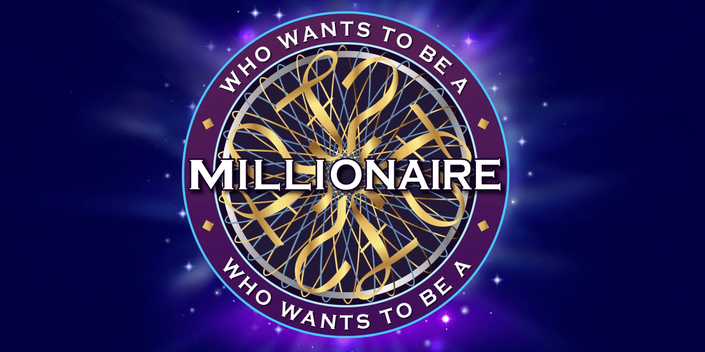

# Who Wants To Be A Millionaire 🎮💰

A Python implementation of the classic "Who Wants To Be A Millionaire" game with a graphical user interface built using Tkinter.



## 📋 Description

This interactive trivia game faithfully recreates the experience of the popular TV show. Answer 15 questions correctly to win the grand prize! The game features lifelines, background music, and support for both English and Arabic questions.

## ✨ Features

- **15 Progressive Questions**: Answer increasingly difficult questions to win up to 1 million Euros
- **Three Lifelines**:
  - 50:50 - Removes two incorrect answers
  - Ask the Audience - Shows poll results (simulated)
  - Phone a Friend - Get a hint from a friend (voice-enabled)
- **Audio Effects**: Background music, sound effects, and text-to-speech for the phone lifeline
- **Bilingual Support**: Works with both English and Arabic questions
- **Custom Question Sets**: Easy to add your own questions via the questions.txt file
- **Intuitive GUI**: Clean interface with images and buttons

## 🎮 Screenshots

### Start Screen

*The game's welcome screen with the iconic logo*

### Game Window

*Main gameplay interface showing question, answer choices, and lifelines*

### Progress Tracker


## 🚀 Installation

1. **Clone the repository**
```bash
git clone https://github.com/yourusername/millionaire-game.git
cd millionaire-game
```

2. **Install required dependencies**
```bash
pip install -r requirements.txt
```

3. **Run the game**
```bash
python main.py
```

## 📦 Requirements

- Python 3.7+
- Pillow (PIL)
- pygame
- pyttsx3
- arabic-reshaper
- tkinter (usually comes with Python)

See `requirements.txt` for specific versions.

## 📁 Project Structure

```
millionaire-game/
│
├── classes/
│   ├── GUI.py           # Main GUI class
│   ├── Questions.py     # Question handling
│   └── Audio.py         # Audio and TTS management
│
├── images/              # Game images and icons
│   ├── start_BG.png
│   ├── questions.png
│   ├── H1.png, H2.png, H3.png (lifeline icons)
│   └── n0.png - n15.png (progress indicators)
│
├── audios/              # Sound files
│   ├── theme.mp3
│   ├── theme_win.mp3
│   └── phone_sound.mp3
│
├── questions.txt        # Question database
├── main.py             # Entry point
└── requirements.txt    # Dependencies
```

## 📝 Question Format

The `questions.txt` file should follow this format:

```
[Number of total questions in file]
Question 1?
Answer A
Answer B
Answer C
Answer D
Correct Answer
Question 2?
...
```

The game randomly selects 15 questions from your question bank each time you play.

## 🎯 How to Play

1. Click **Start** on the welcome screen
2. Read the question carefully
3. Click on your chosen answer (A, B, C, or D)
4. Use lifelines when needed:
   - Click the **50:50** button to eliminate two wrong answers
   - Click the **Ask the Audience** button to see poll results
   - Click the **Phone a Friend** button to get a voiced hint
5. Answer all 15 questions correctly to win!

## 🎵 Audio Features

- Background theme music plays during gameplay
- Victory theme when you win
- Phone ringing sound for the Phone-a-Friend lifeline
- Text-to-speech voice tells you the suggested answer

## 🌍 Language Support

The game supports both English and Arabic text through the `arabic-reshaper` library, which properly formats Arabic text for display.

## 🤝 Contributing

Contributions are welcome! Feel free to:

- Add new question sets
- Improve the UI/UX
- Add new features
- Fix bugs
- Improve documentation

Please open an issue first to discuss what you would like to change.

## 📄 License

This project is licensed under the MIT License - see the [LICENSE](LICENSE) file for details.

## 🙏 Acknowledgments

- Inspired by the classic "Who Wants To Be A Millionaire" TV show
- Images and audio assets from [Coding Lifestyle 4u](https://www.youtube.com/@codinglifestyle4u) YouTube channel - [Tutorial Video](https://www.youtube.com/watch?v=uj_52lCH4I8)
- Game implementation and code written independently from scratch by me
- Built with Python and Tkinter
- Uses pygame for audio playback
- TTS powered by pyttsx3


<!-- CONTACT -->
<table align="center" width="80%">
<tr>
  <td width="40%" align="center" valign="middle">
    <p style="font-size:48px;">
      
      <strong>CONTACT ME</strong>
    </p>
  </td>
  <td width="60%" align="center">
    <table>
      <tr>
        <td align="center" width="25%">
          <a href="https://www.linkedin.com/in/amr-ashraf-86457134a/" target="_blank">
            
          </a>
        </td>
        <td align="center" width="25%">
          <a href="https://github.com/TendoPain18" target="_blank">
            
          </a>
        </td>
        <td align="center" width="25%">
          <a href="mailto:amrgadalla01@gmail.com">
            
          </a>
        </td>
        <td align="center" width="25%">
          <a href="https://www.facebook.com/amr.ashraf.7311/" target="_blank">
            
          </a>
        </td>
      </tr>
    </table>
  </td>
</tr>
</table>
<!-- END CONTACT -->

---

**Enjoy the game and good luck becoming a millionaire! 💰✨**
